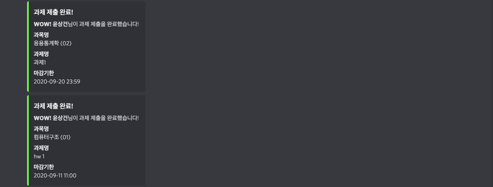
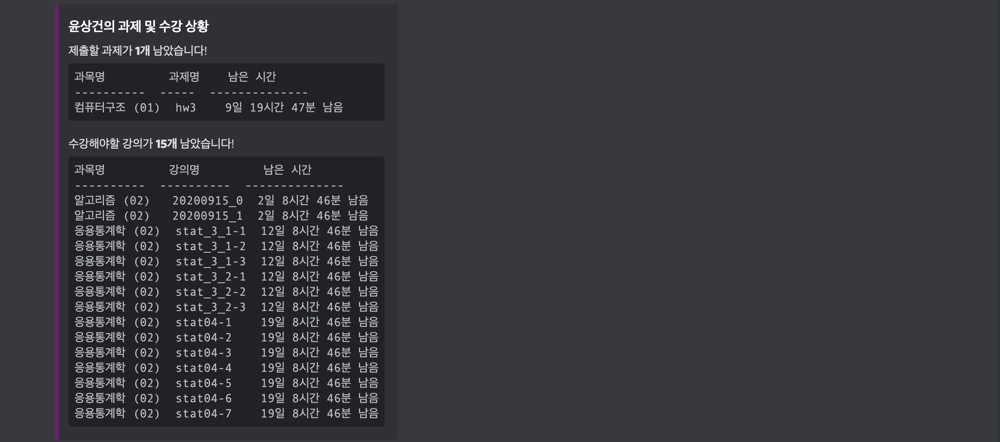

# ECampusBot
Discord bot for reminding due dates of assignments




## Adding user

You can add your e-campus account by adding `src/users.csv` file that containing following format.

```
username1,userid1,userpw1
username2,userid2,userpw2
...
```

*Note: uesrname can be any string*
